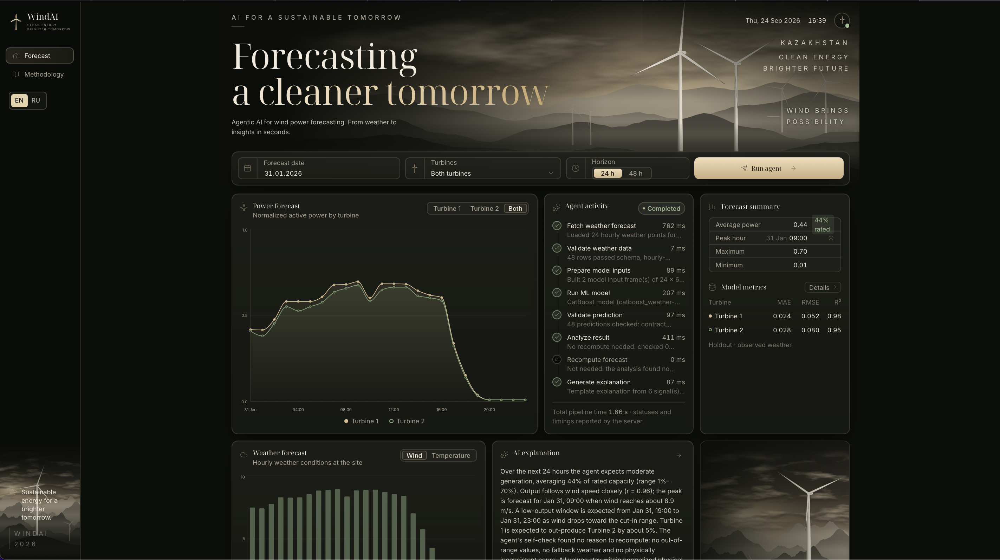

# WindAI — Wind Power Forecasting

**An interactive dashboard that forecasts wind turbine output and explains the result.** WindAI combines trained CatBoost models, archived weather forecasts and a FastAPI agent pipeline to estimate hourly power for two turbines in Kazakhstan over a **24- or 48-hour horizon**.

The project explores how a station operator could identify generation peaks, low-output periods and unusual conditions before planning the next day's operations.

**This version is a historical forecasting demo:** select a forecast date between **January 31 and February 28, 2026**. It replays forecasts using weather information available at the selected time. Current-date forecasting is not enabled.

[](docs/images/windai-dashboard.png)

*The English dashboard showing a 24-hour forecast for both turbines. Use the EN/RU switch to change the language; your preference is saved.*

## What you can do

- **Compare turbines:** view hourly power forecasts for either turbine or both together.
- **Inspect the weather:** explore wind speed and temperature alongside expected output.
- **See the key numbers:** average power, minimum, maximum and peak hour.
- **Follow the agent:** inspect each pipeline step, its status, message and execution time.
- **Read an explanation:** understand expected generation, low-output windows and warnings in English or Russian.
- **Review model quality:** see holdout metrics and the conditions under which they were measured.

Power is normalized to each turbine's rated capacity: **`0.5` means 50% of rated power**, not 50% prediction accuracy. The charts do not report output in megawatts.

## How it works

The React dashboard sends a forecast request to FastAPI. The agent then runs this pipeline:

```text
Fetch weather → Validate weather → Prepare model inputs → Run CatBoost
    → Validate predictions → Analyze results → Recompute if needed → Explain
```

The weather service retrieves archived **Open-Meteo Single Runs** forecasts or reads the bundled archive. Each turbine has its own trained CatBoost model; earlier model snapshots support dates before the main models' training cutoff.

The agent checks missing values, hourly continuity, physical ranges and consistency between wind and predicted power. Updated weather inputs, clipped predictions or substantial physical inconsistencies can trigger **one recomputation**. If that retry fails, the original validated forecast is retained with a warning.

This orchestration is implemented in Python. **CatBoost produces the numerical forecast.** An optional OpenAI call explains facts already calculated by the pipeline. Without an API key, a deterministic template generates the explanation; the power predictions still come from the real trained models.

## Model evaluation

Model selection used chronological validation periods. The final holdout evaluation covered **December 2025 through January 2026**, using models trained only on earlier data.

| Turbine | MAE ↓ | RMSE ↓ | R² ↑ |
| --- | ---: | ---: | ---: |
| Turbine 1 | 0.0244 | 0.0522 | 0.9796 |
| Turbine 2 | 0.0281 | 0.0798 | 0.9518 |

The average absolute error corresponds to approximately **2.44 and 2.81 percentage points of rated capacity**. MAE was about **29% lower** than the wind-to-power baseline for each turbine.

**These are power-model scores using observed weather**, not end-to-end accuracy with imperfect weather forecasts. The deployed model bundles were subsequently trained through January 31; the table describes the earlier holdout evaluation.

Historical replay covers **29 forecast dates, 58 agent runs and 4,176 hourly predictions** across both horizons and turbines. Weather availability and model training cutoffs are checked against the forecast origin to avoid using future information. Actual February power measurements were not provided, so February forecast accuracy has not been measured.

[Model comparison](ml/reports/model_comparison.md) · [Reproducibility audit](ml/reports/ml_audit.md) · [Replay manifest](reports/agent_backtest/manifest.json) · [Agent run logs](reports/agent_backtest/runs.jsonl)

## Run locally

Install and start Docker with Docker Compose, then run:

```bash
git clone https://github.com/mlkad/ai-wind.git
cd ai-wind
docker compose up --build
```

Open **[http://localhost:5173](http://localhost:5173)**. Try **February 1, 2026 → Both turbines → 48 h → Run agent**. The dashboard also runs an initial forecast automatically.

The first build requires internet access to download dependencies. Trained models and a weather archive are included in the repository; no API key is required. API documentation is available at **[http://localhost:8000/docs](http://localhost:8000/docs)**.

For optional configuration, copy `.env.example` to `.env` before starting Docker:

| Setting | Purpose |
| --- | --- |
| `MODEL_ADAPTER=real` | Use the bundled CatBoost models; this is the default. |
| `WEATHER_PROVIDER=open_meteo` | Retrieve archived Single Runs forecasts, with the saved archive as fallback. |
| `WEATHER_PROVIDER=archive` | Use the bundled weather archive without weather API requests. |
| `OPENAI_API_KEY` | Optional: enable LLM explanations. Leave empty for template explanations. |

The dashboard sends its selected language with each request. Switching EN/RU reruns the last submitted forecast to generate matching agent messages and explanations. The preference persists across page reloads.

## Stack and repository layout

| Layer | Technologies | Location |
| --- | --- | --- |
| Dashboard | React, TypeScript, Vite, Tailwind CSS, Recharts, i18next | [`frontend/`](frontend/) |
| API and agent | FastAPI, Pydantic, pandas | [`backend/`](backend/) |
| Forecasting | CatBoost, per-turbine models and inference code | [`ml/`](ml/) |
| Weather inputs | Archived Open-Meteo Single Runs | [`data/weather/`](data/weather/) |
| Evidence | Replay outputs and recorded release checks | [`reports/`](reports/) |
| Deployment | Docker Compose and a single-service Render configuration | [`render.yaml`](render.yaml), [`Dockerfile.render`](Dockerfile.render) |

The Render configuration packages the built dashboard and API into one Docker service. It is deployment configuration, not evidence of a running public instance.

## Development checks

Frontend:

```bash
cd frontend
npm ci
npm test
npm run build
```

Backend, from the repository root in an activated Python virtual environment:

```bash
pip install -r backend/requirements-dev.txt -r backend/requirements-ml.txt
PYTHONPATH=backend python -m pytest backend/tests -q
```

The backend tests cover validation, model failures, weather fallback, recomputation and request-scoped EN/RU behavior. Frontend tests check translation coverage, interpolation parameters and plural forms. Earlier release checks are recorded in [`reports/release_validation.json`](reports/release_validation.json); they describe that release rather than a current deployment.

Further documentation: [Frontend](frontend/README.md) · [Backend](backend/README.md) · [ML](ml/README.md). Some detailed technical reports are in Russian.
